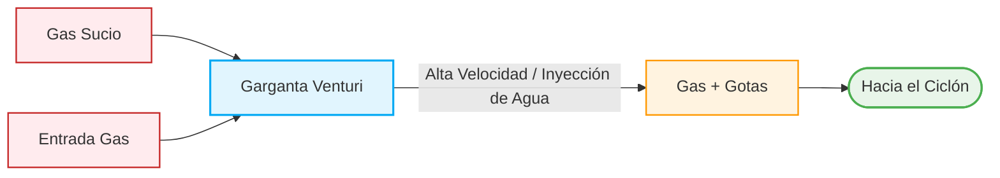
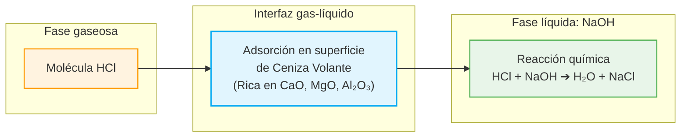

## El dilema operativo de la depuración industrial y la respuesta de la ingeniería

En el ejercicio de la ingeniería ambiental, pocas tareas demandan tanta resistencia técnica como el tratamiento de efluentes gaseosos industriales complejos. Cuando una planta siderúrgica, una caldera de biomasa, un incinerador de residuos o un secador de harina de pescado descarga una corriente de gas saturada de humedad, grasas, alquitranes o sustancias pegajosas, los sistemas convencionales de filtración seca colapsan de manera sistemática (Nevers, 1998; Kutz, 2018).

Los filtros de mangas —mecanismos de tela altamente eficientes para capturar polvo seco mediante sacudido o chorro de aire comprimido— sufren lo que en planta llamamos un cegamiento irreversible (*blinding*): la humedad y las resinas aglomeran el polvo sobre la tela, taponando sus poros microfinos e inhabilitando el paso del aire (Nevers, 1998; Mihelcic, 2012). Por su parte, los precipitadores electrostáticos secos, que emplean campos de alto voltaje para ionizar las partículas y atraparlas en placas colectoras, ven interrumpida su conductividad eléctrica cuando las partículas grasas o aislantes forman capas dieléctricas pasivantes sobre los electrodos (Nevers, 1998; Turner et al., 2002).

Ante esta encrucijada, la ingeniería de control de emisiones recurre a la estrategia del cizallamiento hidráulico: el lavador Venturi (Nevers, 1998). Perteneciente a la familia de los colectores húmedos de alta eficiencia, este equipo fue concebido específicamente para remover material particulado fino y submicrónico en corrientes donde la filtración seca resulta inviable (Nevers, 1998; Kutz, 2018).

Para dimensionar la magnitud de este problema en términos cotidianos, cuando hablamos de **material particulado fino (PM10 y PM2.5)**, nos referimos a diminutas partículas sólidas o líquidas suspendidas en el aire. Las partículas \\(\text{PM}\_{10}\\) miden menos de 10 micrómetros (menos de una décima parte del grosor de un cabello humano), mientras que las \\(\text{PM}\_{2.5}\\) tienen un tamaño inferior a 2.5 micrómetros, tan diminutas que no se detienen en las mucosas nasales y pueden penetrar hasta lo más profundo de nuestros alvéolos pulmonares (Nevers, 1998; Kutz, 2018).

Para atrapar polvo tan pequeño en unidades convencionales a contraflujo —donde el agua cae desde arriba y el gas asciende desde abajo—, el sentido común diría que basta con aumentar la velocidad del gas. Sin embargo, al acelerar el gas en una torre vertical estándar, la fuerza del aire arrastra las gotas de agua hacia afuera por la chimenea, anulando el lavado (Nevers, 1998). El lavador Venturi resuelve este bloqueo introduciendo un diseño de **flujo coordinado (*co-current flow*)**, una configuración donde el gas contaminado y el agua de lavado se inyectan exactamente en la misma dirección a través de un canal que se estrecha (Nevers, 1998; Kutz, 2018).

Desde una perspectiva de la filosofía de la tecnología y la psicología de las decisiones de diseño, el lavador Venturi encarna la paradoja de la fuerza bruta. En lugar de lidiar con la fragilidad de un medio filtrante de tela, los diseñadores prefieren invertir enormes cantidades de energía eléctrica para acelerar el gas a velocidades de huracán. Es la preferencia conductual por la potencia tolerable sobre la sutileza vulnerable: se acepta un gasto continuo de electricidad a cambio de un equipo mecánicamente simple que jamás se obstruirá en la zona de contacto.

<figure class="post-figure">

<figcaption>Figura 1. Partes componentes de la instalación de un lavador de gases Venturi. Fuente: Nevers (1998).</figcaption>
</figure>

## Mecánica del cizallamiento e impactación inercial en la garganta

El corazón operativo de un lavador Venturi es un ducto cónico que consta de tres secciones geométricas consecutivas, la sección convergente, la garganta y la sección divergente (Kutz, 2018). La física del sistema reposa sobre la transformación contínua de energía cinético-potencial y la transferencia de masa entre fases (Nevers, 1998; Kutz, 2018).

1. **Aceleración en la sección convergente:** La corriente de gas sucio ingresa a un canal con un área transversal que se reduce gradualmente. Esta restricción fuerza un incremento drástico de la velocidad lineal del gas por conservación del caudal volumétrico (Kutz, 2018).
2. **Atomización e inyección en la garganta:** Al alcanzar la garganta —la sección de área mínima—, el gas alcanza velocidades lineales comprendidas habitualmente entre \\(30.5 \text{ m/s}\\) y \\(45.7 \text{ m/s}\\), pudiendo llegar en ciertos diseños extremos hasta \\(122 \text{ m/s}\\) (~440 km/h) (Nevers, 1998; Kutz, 2018). En este punto de máxima velocidad, se inyecta el agua de lavado de forma perpendicular al flujo gaseoso con una velocidad axial inicial cercana a cero (Nevers, 1998; Kutz, 2018). El brutal esfuerzo de **cizallamiento** (*shear stress*) ejercido por el gas desgaja el chorro de líquido, atomizándolo de manera instantánea en millones de microgotas con diámetros inferiores a \\(100 \ \mu\text{m}\\) (Kutz, 2018).
3. **Captura por impactación inercial:** En el tramo inicial de la garganta se genera la máxima velocidad relativa (\\(V_{\text{Rel}}\\)) entre el gas cargado de polvo y las gotas de agua recién formadas que parten desde el reposo (Nevers, 1998). Aquí opera el mecanismo fundamental de remoción: la **impactación inercial** (Kutz, 2018).

Para explicar la impactación inercial de manera más simple: imagina que manejas un vehículo a alta velocidad en la carretera y de pronto te aproximas a un enjambre de insectos. El aire frente a tu auto se desvía suavemente alrededor del parabrisas, pero los insectos, al poseer mayor masa e inercia, no pueden seguir las curvas de la línea de viento y chocan inevitablemente contra el cristal. En la garganta del Venturi, la gota atomizada actúa como el parabrisas y las partículas de polvo suspendidas son los insectos. Debido a su inercia, las partículas no logran esquivar la gota de agua y quedan atrapadas dentro de ella (Nevers, 1998; Kutz, 2018).

El parámetro central para predecir si una partícula será capturada es su **diámetro aerodinámico de corte (\\(d_{50}\\))**, definido como el tamaño geométrico y de densidad equivalente para el cual el lavador logra una eficiencia de recolección exacta del 50 % (Nevers, 1998). Para partículas mayores a 5 micrómetros, la eficiencia roce el 99 %, manteniéndose altamente efectivo incluso en la franja submicrónica (Nevers, 1998; Kutz, 2018).

4. **Recuperación de presión en la sección divergente:** La mezcla de gas, agua y partículas atrapadas pasa a la sección divergente. Allí, el área transversal se expande suavemente, desacelerando el fluido y reconvirtiendo la energía cinética de alta velocidad en presión estática (Kutz, 2018).
5. **Separación de fases gas-líquido:** El gas limpio pero cargado de humedad y gotas gruesas descarga hacia un separador inercial secundario, generalmente un ciclón de gran dimensión (Nevers, 1998; Metcalf y Eddy et al., 2003). Por fuerza centrífuga, las gotas densas son proyectadas contra las paredes del ciclón y caen hacia el fondo como un efluente líquido con lodos, mientras el gas depurado asciende limpio por el vórtice central hacia la chimenea (Nevers, 1998; Metcalf y Eddy et al., 2003).

<figure class="post-figure">

<figcaption>Figura 1. Partes componentes de la instalación de un lavador de gases Venturi. Fuente: Nevers (1998).</figcaption>
</figure>

## Demostración matemática paso a paso: Aceleración de gotas y penalización energética

Para comprender el esfuerzo físico que ocurre dentro de la garganta de un lavador Venturi, es indispensable desarrollar los cálculos cinéticos y de potencia a partir de las ecuaciones fundamentales de balance de masa y momento (Nevers, 1998).

### Cálculo 1: Aceleración instantánea de las gotas de agua atomizadas en la garganta

Cuando la gota de agua entra a la garganta a velocidad axial cero, es embestida por la corriente de gas que viaja a más de \\(100 \text{ m/s}\\). La aceleración lineal (\\(a = \frac{dV}{dt}\\)) que sufre la gota viene dada por la relación entre la fuerza de arrastre aerodinámico y la masa de la gota esférica (Nevers, 1998):

\\[ a = \frac{F_{\text{arrastre}}}{m_{\text{gota}}} = \frac{(\pi/4) \cdot D_D^2 \cdot C_d \cdot \rho_{\text{aire}} \cdot \frac{V^2}{2}}{(\pi/6) \cdot D_D^3 \cdot \rho_D} = \frac{1.5 \cdot C_d \cdot \rho_{\text{aire}} \cdot V^2}{2 \cdot D_D \cdot \rho_D} \\]

Donde:
* **\\(a\\)**: aceleración de la gota de agua (\\(\text{m/s}^2\\)).
* **\\(C_d\\)**: coeficiente de arrastre aerodinámico adimensional (tomado como \\(0.7\\) para gotas de agua en flujo turbulento) (Nevers, 1998).
* **\\(\rho_{\text{aire}}\\)**: densidad del gas entrante (\\(1.20 \text{ kg/m}^3\\)) (Nevers, 1998).
* **\\(V\\)**: velocidad relativa inicial del gas en la garganta (\\(106.7 \text{ m/s}\\) o 350 ft/s) (Nevers, 1998).
* **\\(D_D\\)**: diámetro medio de la gota atomizada (\\(100 \ \mu\text{m} = 10^{-4} \text{ m}\\)) (Nevers, 1998; Kutz, 2018).
* **\\(\rho_D\\)**: densidad del líquido de lavado (agua = \\(1000 \text{ kg/m}^3\\)) (Nevers, 1998).

### Desarrollo numérico paso a paso:

\\[ \begin{align\*} \text{Numerador} &= 1.5 \cdot 0.7 \cdot 1.20 \text{ kg/m}^3 \cdot (106.7 \text{ m/s})^2 \\\\ \text{Numerador} &= 1.05 \cdot 1.20 \text{ kg/m}^3 \cdot 11384.89 \text{ m}^2/\text{s}^2 = 14344.96 \text{ kg}/(\text{m} \cdot \text{s}^2) \\\\ \text{Denominador} &= 2 \cdot 0.0001 \text{ m} \cdot 1000 \text{ kg/m}^3 = 0.2 \text{ kg/m}^2 \\\\ a &= \frac{14344.96 \text{ kg}/(\text{m} \cdot \text{s}^2)}{0.2 \text{ kg/m}^2} \\\\ a &= 71724.8 \text{ m/s}^2 \approx 7.2 \cdot 10^4 \text{ m/s}^2 \end{align\*} \\]

***Nota técnica:*** La gota experimenta en la garganta una aceleración instantánea de aproximadamente \\(7.2 \cdot 10^4 \text{ m/s}^2\\). Al comparar este valor frente a la aceleración de la gravedad terrestre (\\(g = 9.81 \text{ m/s}^2\\)), constatamos que el líquido es acelerado a más de 7,300 veces la fuerza de la gravedad (o equivalente a 3,700 g si se evalúa en unidades imperiales relativas). Esta aceleración titánica es el motor físico que mantiene una altísima velocidad relativa entre la gota y el gas, permitiendo la captura de partículas finas.

### Cálculo 2: Potencia teórica del ventilador y costo energético de operación anual

La elevadísima velocidad del gas en la garganta no es gratuita, se paga en forma de **caída de presión (\\(\Delta P\\))**. La potencia teórica (\\(P\\)) consumida por el ventilador o soplador para vencer esta resistencia neumática se calcula mediante el producto del caudal volumétrico del gas y la caída de presión del equipo (Nevers, 1998):

\\[ P = Q_G \cdot \Delta P \\]

Donde:
* **\\(P\\)**: potencia teórica del ventilador en Watts (\\(\text{W}\\)) o \\(\text{N} \cdot \text{m/s}\\).
* **\\(Q_G\\)**: caudal volumétrico del gas a través del Venturi en \\(\text{m}^3/\text{s}\\).
* **\\(\Delta P\\)**: caída de presión del lavador en Pascales (\\(\text{Pa}\\) o \\(\text{N/m}^2\\)).

### Desarrollo numérico basado en los datos típicos de diseño industrial:
* Área de la garganta del Venturi: \\(A = 0.5 \text{ m}^2\\).
* Velocidad del gas en la garganta: \\(V = 100 \text{ m/s}\\).
* Caída de presión del sistema: \\(\Delta P = 100 \text{ cm H}\_2\text{O} = 9806 \text{ N/m}^2\\) (Pascales) (Nevers, 1998).

#### Paso 1: Cálculo del caudal volumétrico de gas (\\(Q_G\\))

\\[ \begin{align\*} Q_G &= A \cdot V \\\\ Q_G &= 0.5 \text{ m}^2 \cdot 100 \text{ m/s} = 50 \text{ m}^3/\text{s} \end{align\*} \\]

#### Paso 2: Cálculo de la potencia consumida por el ventilador (\\(P\\))

\\[ \begin{align\*} P &= 50 \text{ m}^3/\text{s} \cdot 9806 \text{ N/m}^2 \\\\ P &= 490300 \text{ W} = 490.3 \text{ kW} \end{align\*} \\]

#### Paso 3: Cálculo del consumo energético y costo económico de operación anual
Asumiendo una operación continua de la planta industrial de 8,760 horas al año y una tarifa eléctrica industrial conservadora de 0.05 USD por kilowatt-hora (\\(\text{USD/kWh}\\)) (Nevers, 1998):

\\[ \begin{align\*} \text{Energía Anual} &= 490.3 \text{ kW} \cdot 8760 \text{ h/año} = 4295028 \text{ kWh/año} \\\\ \text{Costo Anual} &= 4295028 \text{ kWh/año} \cdot 0.05 \text{ USD/kWh} = 214751.40 \text{ USD/año} \end{align\*} \\]

***Nota técnica:*** Para vencer una caída de presión de \\(100 \text{ cm H}\_2\text{O}\\) en un flujo gaseoso de \\(50 \text{ m}^3/\text{s}\\), se requiere un ventilador de tiro inducido de casi \\(500 \text{ kW}\\) operando continuamente. En términos económicos, el costo de electricidad supera los 214,000 USD anuales solo para operar el ventilador. Esto demuestra por qué el gasto energético es la variable dominante del costo del ciclo de vida en un lavador Venturi: en muy pocos años de operación, la factura de energía supera con creces el costo inicial de compra e instalación del equipo.

Para proteger mecánicamente la instalación, los ingenieros ubican siempre este ventilador gigantesco **aguas abajo** del separador de gotas (sistema en presión negativa) (Elortegui y Barbosa, 2013). De este modo, el ventilador maneja exclusivamente gas depurado y saturado, evitando que las cenizas abrasivas destruyan los álabes del rodete (Elortegui y Barbosa, 2013).

## Evolución tecnológica: Lavadores autoaspirantes y el lecho de burbujeo sumergido

La necesidad de simplificar la operación industrial y garantizar la máxima confiabilidad operacional impulsó la evolución desde los lavadores de alimentación forzada —que dependen de bombas hidráulicas externas para inyectar el agua a presión— hacia los **lavadores Venturi autoaspirantes (*self-priming Venturi scrubbers*)** (Ali et al., 2020; Bal et al., 2020).

Para explicar este concepto de manera más sencilla: en un lavador autoaspirante, el propio movimiento del gas crea su propia fuerza de succión hidráulica. Imagina que soplas con mucha fuerza a través de un sorbete que tiene un pequeño orificio lateral sumergido en un vaso con agua; la caída de presión producida por la velocidad de tu aliento succiona automáticamente el agua hacia el interior del tubo sin necesidad de ninguna bomba mecánica (Ali et al., 2020; Bal et al., 2020).

En términos hidráulicos, la inyección de líquido en la garganta ocurre impulsada por la diferencia de presión entre la cabeza hidrostática de la columna de agua (\\(\Delta H\\)) y la presión estática del gas en la garganta (\\(P_{\text{TH}}\\)) (Ali et al., 2020; Bal et al., 2020). El agua ingresa a la garganta a través de múltiples orificios periféricos en forma de chorros radiales (*jets*), los cuales son desgajados e instantáneamente atomizados en microgotas por la corriente gaseosa de alta velocidad (Ali et al., 2020).

```mermaid
graph TD
    %% El contenedor superior se define en TD para alinear los subgrafos en columnas horizontales

    subgraph ConfigNoSumergida["Configuración No Sumergida"]
        A1["Nivel de Agua\nMenor a la altura del scrubber"]
        A1 --> B1[\Convergente/]
        B1 --> C1[=== Garganta ===]
        C1 --> D1[/Divergente\]
        D1 --> E1([Salida de Gas])
    end

    subgraph ConfigSumergida["Configuración Sumergida"]
        A2[Lecho de burbujeo]
        A2 --> B2["~ Nivel de Agua ~\n(Scrubber totalmente sumergido)"]
        B2 --> C2[\Convergente/]
        C2 --> D2[=== Garganta ===]
        D2 --> E2[/Divergente\]
        E2 --> F2([Salida de Gas])
    end

    %% Personalización de estilos visuales profesionales
    style A1 fill:#fff3e0,stroke:#ff9800,stroke-width:1.5px
    style B2 fill:#e1f5fe,stroke:#03a9f4,stroke-width:2px
    style E1 fill:#e8f5e9,stroke:#4caf50,stroke-width:2px
    style F2 fill:#e8f5e9,stroke:#4caf50,stroke-width:2px
```

Un avance decisivo en el diseño cinético de estos equipos radica en la distinción entre dos regímenes de operación hidrodinámica: **no sumergido** y **sumergido** (Bal et al., 2020).

1. **Régimen no sumergido:** El nivel del reservorio de agua que rodea al lavador se mantiene por debajo de la altura total del cuerpo del Venturi. La separación de partículas ocurre de forma exclusiva en la zona de la garganta por la impactación inercial entre las gotas atomizadas y el polvo (Bal et al., 2020).
2. **Régimen sumergido:** El lavador Venturi se encuentra completamente inmerso dentro del tanque del líquido de lavado. Al emerger de la sección divergente, el gas depurado no descarga directamente a un espacio libre, sino que se abre paso a través de una columna de líquido, formando un **lecho turbulento de burbujas (*bubble bed*)** (Bal et al., 2020).

Esta configuración sumergida crea una segunda etapa consecutiva de transferencia de masa y captura inercial: el contaminante interactúa primero con las gotas atomizadas en la garganta y, posteriormente, con la masa de líquido circundante durante el ascenso de las burbujas (Bal et al., 2020). Experimentos comparativos demuestran que a una velocidad de gas en la garganta de \\(60 \text{ m/s}\\), la eficiencia de remoción de ceniza volante (*fly ash*) se eleva desde un 88.8 % en modo no sumergido hasta un **99.89 %** en modo sumergido, alcanzando concentraciones de salida de material particulado de apenas \\(330 \ \mu\text{g/Nm}^3\\), plenamente acordes con los Estándares de Protección Ambiental (Bal et al., 2020).

<figure class="post-figure">

<figcaption>Figura 3. Configuración hidrodinámica de un lavador Venturi autoaspirante en régimen sumergido vs. no sumergido. Fuente: Bal et al. (2020).</figcaption>
</figure>

## Remoción simultánea multifase: Sinergia catalítica entre gases ácidos y ceniza volante

Los efluentes gaseosos generados en la combustión de biomasa, la incineración de residuos o los procesos metalúrgicos rara vez contienen un solo contaminante; por el contrario, transportan mezclas complejas de material particulado junto con gases altamente corrosivos y tóxicos, principalmente cloruro de hidrógeno (\\(\text{HCl}\\)) y dióxido de azufre (\\(\text{SO}\_2\\)) (Bal et al., 2019; Liu et al., 2025).

La práctica industrial clásica abordaba este problema mediante esquemas secuenciales en dos etapas: primero un filtro seco (de mangas o precipitador electrostático) para retirar el polvo, y posteriormente una torre de absorción para neutralizar los gases ácidos (Bal et al., 2019). No obstante, la tecnología de lavado Venturi permite la **remoción simultánea en una sola etapa**, optimizando radicalmente los costos de inversión (CAPEX) y espacio de planta (Bal et al., 2019).

Al emplear una solución alcalina diluida como líquido de lavado (por ejemplo, hidróxido de sodio \\(0.005 \text{ N NaOH}\\)), la transferencia de masa del gas \\(\text{HCl}\\) hacia la fase líquida se gobierna por el modelo de la doble película, donde la absorción física se combina de manera instantánea con la reacción química de neutralización neutra (Bal et al., 2019):

\\[ \text{HCl}\_{(aq)} + \text{NaOH}\_{(aq)} \rightarrow \text{H}\_2\text{O}\_{(l)} + \text{NaCl}\_{(aq)} \\]

Lo verdaderamente revelador en la física de procesos —comprobado experimentalmente por estudios de difracción de rayos X (XRF) y espectrometría de dispersión de energía (EDX)— es el **efecto catalítico directo que ejerce la ceniza volante (*fly ash*) sobre la absorción de gases ácidos** (Bal et al., 2019).

La ceniza volante industrial no es inerte, está constituida por un mosaico de óxidos metálicos básicos como óxido de calcio (\\(\text{CaO}\\)), óxido de magnesio (\\(\text{MgO}\\)) y alúmina (\\(\text{Al}\_2\text{O}\_3\\)) (Bal et al., 2019; Bal et al., 2020). Durante la turbulencia extrema en la garganta y el lecho de burbujas, las partículas de ceniza volante suspendidas se adscriben a las burbujas de gas, ofreciendo una vasta área superficial activa donde las moléculas de \\(\text{HCl}\\) se adsorben de forma preferente (Bal et al., 2019). 

Esta sinergia interfacial incrementa el coeficiente global de transferencia de masa, traduciéndose en un **aumento del 7 % al 10 % en la eficiencia de remoción de \\(\text{HCl}\\)** en presencia de ceniza volante en comparación con el lavado del gas limpio sin partículas (Bal et al., 2019). A parámetros de operación óptimos (velocidad en garganta de \\(60 \text{ m/s}\\), altura de columna de agua de \\(0.77 \text{ m}\\) y carga de \\(\text{HCl}\\) de 500 ppm), el sistema alcanza eficiencias simultáneas del **98.3 % para \\(\text{HCl}\\)** y del **99.91 % para ceniza volante** (Bal et al., 2019).

<figure class="post-figure">

<figcaption>Figura 4. Mecanismo de transferencia de masa de doble película para la absorción de HCl en solución de NaOH. Fuente: Bal et al. (2019).</figcaption>
</figure>

## Aplicaciones de alta severidad: Trenes APCD en incineración médica y seguridad nuclear

Las características operativas del lavador Venturi posicionan a este equipo como un componente insustituible en dos de los escenarios industriales más rigurosos de la ingeniería ambiental y de seguridad:

### 1. Incineración de residuos hospitalarios y peligrosos (MWI)

Los residuos médicos —compuestos por plásticos halogenados como el PVC, hules, gasas y especímenes patológicos— generan al incinerarse a temperaturas superiores a \\(1100 \ ^\circ\text{C}\\) un efluente térmico cargado de metales pesados, dioxinas, compuestos orgánicos volátiles (COVs) y gases altamente ácidos (Liu et al., 2025).

En las plantas modernas de Incineración de Residuos Médicos (MWI), el lavador Venturi se integra al final de un tren complejo de Dispositivos de Control de Contaminación del Aire (APCDs), ubicado estratégicamente aguas abajo de la cámara de enfriamiento rápido (*quenching*), el inyector de carbón activado (ACI) y el filtro de mangas (FF) (Liu et al., 2025). 

En esta configuración coordinada, los filtros secos reducen la concentración de material particulado a niveles inferiores a \\(1.9 \text{ mg/m}^3\\), mientras que el lavador húmedo secundario actúa como barrera *polishing*, abatiendo el \\(\text{HCl}\\) residual hasta \\(0.71 \text{ mg/m}^3\\) y atrapando por condensación y solubilidad los COVs altamente odoríferos e hidrofílicos (Liu et al., 2025). Esta acción combinada reduce el Valor de Actividad Olorosa Total (\\(\text{OAV}\_{\text{T}}\\)) del gas desde \\(2.53\\) (condición de severo riesgo de contaminación por olores) a solo \\(0.89\\), garantizando que las emisiones a la atmósfera no generen impacto ni molestias sanitarias en las comunidades vecinas (Liu et al., 2025).

### 2. Sistemas de Ventilación de Contención Filtrada (FCVS) en centrales nucleares

En el eventual escenario de un accidente severo con fusión del núcleo (*core meltdown*) en una central nuclear de potencia, la interacción entre el corio fundido y el hormigón de la estructura genera enormes volúmenes de gases no condensables y aerosoles radiactivos submicrónicos (como isótopos de yodo \\(\text{I}\_2\\), yoduro de cesio \\(\text{CsI}\\) y óxidos metálicos pesados) (Ali et al., 2020).

Para evitar el colapso estructural del edificio de contención por sobrepresión, se activan los **Sistemas de Ventilación de Contención Filtrada (FCVS)**, cuya función es despresurizar pasivamente la contención hacia la atmósfera reteniendo la totalidad de los radionúclidos (Ali et al., 2020). 

Aquí, el lavador Venturi autoaspirante constituye el corazón del sistema húmedo de filtración: al ser totalmente autopropulsado por la propia presión del gas de contención, no requiere energía eléctrica externa ni bombas auxiliares para inyectar el líquido de lavado (Ali et al., 2020; Bal et al., 2020). El lavador encapsula los aerosoles insolubles y absorbe las especies gaseosas de yodo dentro de la piscina de lavado, logrando factores de descontaminación extraordinariamente altos y reteniendo más del 99 % de la carga radiactiva antes de que el gas atraviese los filtros metálicos profundos de seguridad (Ali et al., 2020; Bal et al., 2020).

## La paradoja de la transferencia de fase y el balance ambiental bajo el marco peruano

El análisis integral de un sistema de depuración no finaliza en la chimenea; por el contrario, la evaluación del lavador Venturi exige examinar el ciclo de vida global del contaminante (Nevers, 1998; Kutz, 2018). Este equipo no destruye la materia ni altera la masa del contaminante: aplica trabajo mecánico para **transferir la contaminación de la fase gaseosa a la fase líquida** (Nevers, 1998; Kutz, 2018).

Al hacer pasar el gas sucio por la garganta y lavar las partículas con agua, el problema de calidad del aire que amenazaba la atmósfera se convierte en un efluente acuoso cargado de lodos, metales pesados disueltos y Sólidos Suspendidos Totales (SST) (Nevers, 1998; Metcalf y Eddy et al., 2003). Si esta agua de descarte saliente del separador ciclónico se vierte directamente a un río o alcantarillado sin tratamiento previo, la planta industrial simplemente habrá desplazado su impacto ambiental desde el aire hacia el recurso hídrico (Nevers, 1998; Kutz, 2018).

En el Perú, este dilema de transferencia de fase está estrictamente fiscalizado por el Ministerio del Ambiente (MINAM) y el Organismo de Evaluación y Fiscalización Ambiental (OEFA), a través de una articulación normativa dual:

1. **Protección de la atmósfera (Cuerpo receptor aire):** Las emisiones atmosféricas deben evitar la degradación de la calidad del aire del entorno, regulada por el **Estándar de Calidad Ambiental para Aire (ECA Aire - Decreto Supremo N° 003-2017-MINAM)**, el cual fija un límite de \\(100 \ \mu\text{g/m}^3\\) para \\(\text{PM}\_{10}\\) y de \\(50 \ \mu\text{g/m}^3\\) para \\(\text{PM}\_{2.5}\\) en promedios de 24 horas (Ministerio del Ambiente, 2017a). Simultáneamente, las industrias deben garantizar el cumplimiento de los Límites Máximos Permisibles (LMP) sectoriales en sus chimeneas.
2. **Protección del recurso hídrico (Efluentes y purga):** El agua de sangrado (*purge*) del lavador y las purgas del sedimentador secundario no pueden vertirse libremente. Deben cumplir con los LMP de efluentes del sector correspondiente (PRODUCE, MINEM) y alinearse con los **Estándares de Calidad Ambiental para Agua (ECA Agua - Decreto Supremo N° 004-2017-MINAM)** según la categoría de la cuenca hídrica receptora (Ministerio del Ambiente, 2017b).

Desde la perspectiva de la economía ambiental y de procesos en la industria peruana —como en las plantas de secado de harina de pescado en el litoral o en los tostadores de minerales en la sierra—, la elección de un lavador Venturi representa un compromiso económico inevitable entre **CAPEX** (Costo de Capital) y **OPEX** (Costo de Operación). 

Aunque un Venturi es mecánicamente simple y su precio de fabricación inicial es reducido frente a un precipitador electrostático seco de gran escala, el costo acumulado de la electricidad consumida por el ventilador para vencer caídas de presión de hasta \\(100 \text{ cm H}\_2\text{O}\\) supera rápidamente el valor de compra del equipo en pocos años de operación (Nevers, 1998). Sin embargo, cuando la corriente de gas contiene partículas húmedas, grasas o resinosas que cegarían un filtro de mangas en cuestión de horas, el gasto energético del Venturi se acepta como la única penalización técnica viable para mantener la planta operando de manera continua sin paradas no programadas (Nevers, 1998; Kutz, 2018).

---

## Referencias

- Ali, S., Waheed, K., Qureshi, K., Irfan, N., Ahmed, M., Siddique, W. y Farooq, A. (2020). Experimental investigation of aerosols removal efficiency through self-priming venturi scrubber. *Nuclear Engineering and Technology*, 52(10), 2230–2237.
- Bal, M., Siddiqi, H., Mukherjee, S. y Meikap, B. C. (2019). Design of self priming venturi scrubber for the simultaneous abatement of HCl gas and particulate matter from the flue gas. *Chemical Engineering Research and Design*, 150, 311–319.
- Bal, M., Behera, I. D., Kumari, U., Biswas, S. y Meikap, B. C. (2020). Hydrodynamic study and particulate matter removal in a self priming venturi scrubber. *Environmental Technology y Innovation*, 20, 101167.
- Elortegui, I. y Barbosa, M. R. (2013). *Diseño y optimización de un sistema ciclón-filtro para desempolvado de ambientes industriales*. Asociación Argentina de Ingenieros Químicos (AAIQ).
- Kutz, M. (Ed.). (2018). *Handbook of environmental engineering* (1.ª ed.). John Wiley y Sons, Inc.
- Liu, J., Hou, D., Zhao, D., Sun, Y. y Zhu, B. (2025). Emission characteristics and odor activity of VOCs from a medical waste incineration plant: Evaluating the performance of air pollution control devices. *Process Safety and Environmental Protection*, 204, 108135.
- Metcalf y Eddy, AECOM, Tchobanoglous, G., Stensel, H. D., Tsuchihashi, R. y Burton, F. (2003). *Wastewater Engineering: Treatment and Reuse* (4.ª ed.). McGraw-Hill.
- Mihelcic, J. (2012). *Ingeniería ambiental: fundamentos, sustentabilidad, diseño*. Alfaomega.
- Ministerio del Ambiente. (2017a). *Decreto Supremo N° 003-2017-MINAM: Aprueban Estándares de Calidad Ambiental (ECA) para Aire*. El Peruano.
- Ministerio del Ambiente. (2017b). *Decreto Supremo N° 004-2017-MINAM: Aprueban Estándares de Calidad Ambiental (ECA) para Agua y establecen Disposiciones Complementarias*. El Peruano.
- Nevers, N. de. (1998). *Ingeniería de control de la contaminación del aire* (1.ª ed. en español). McGraw-Hill Interamericana.
- Turner, J. H., Lawless, P. A., Yamamoto, T., Coy, D. W., McKenna, J. D., Mycock, J. C., Nunn, A. B., Greiner, G. P. y Vatavuk, W. M. (2002). *Manual de Costos de Control de Contaminación del Aire de la EPA: Sección 6, Capítulo 3 - Precipitadores Electrostáticos*. U.S. Environmental Protection Agency (EPA).

---

## Preguntas / Vacíos del conocimiento

- ¿Es factible valorizar agronómicamente o en materiales de construcción el lodo neutro enriquecido con sales de cloruro y óxidos de ceniza volante recuperado del sedimentador, o el contenido de metales pesados disueltos condena a este residuo a la categoría irrecuperable de pasivo ambiental peligroso?
- ¿Cómo se degrada la cinética de atomización en la garganta y cuál es el incremento en la tasa de cavitación erosiva cuando el agua de lavado se recircula en circuito cerrado y acumula concentraciones elevadas de Sólidos Suspendidos Totales (\\(\text{SST}\\))?
- ¿Por qué la literatura científica actual aún no ha estandarizado modelos numéricos tridimensionales de Dinámica de Fluidos Computacional (\\(\text{CFD}\\)) que predigan la distribución de tamaño de gota bajo fluidos no newtonianos con alta carga de polímeros u óleos industriales?
- ¿Hasta qué punto el diferencial de costo eléctrico por caída de presión en un lavador Venturi justifica la sustitución tecnológica por precipitadores electrostáticos húmedos (\\(\text{WESP}\\)) en industrias medianas de países en desarrollo como el Perú?
