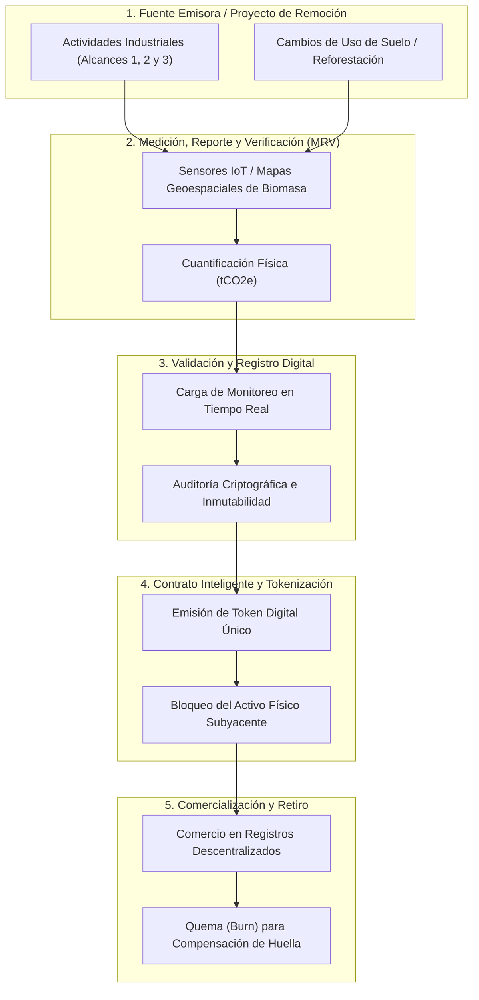

## La contabilidad invisible: de la molécula de carbono a la ficha digital

Los mercados globales de carbono mueven hoy un volumen cercano a los USD 100 000 millones anuales en permisos de emisión y créditos de compensación (Field y Field, 2017). Sin embargo, detrás de esa imponente cifra contable existe una paradoja estructural de trazabilidad: mientras los capitales fluyen a velocidad digital, la verificación física, de si una tonelada de dióxido de carbono equivalente (\\(\text{tCO}_2\text{e}\\)) realmente ha sido capturada o se ha dejado de emitir, sigue arrastrando opacidad, duplicidades y elevados costos de transacción (Abdullayev et al., 2025; Field y Field, 2017). Para solucionar este cuello de botella, la ingeniería ambiental y la informática han convergido en una propuesta innovadora: **la tokenización de carbono.**

Para comprender la tokenización sin perderse en la jerga informática, conviene recurrir a una imagen simple. Imagina que organizas el guardarropa de un evento masivo. Cuando alguien te entrega un abrigo físico pesado (el carbono capturado en un bosque o eliminado de una chimenea), tú le entregas a cambio un ticket numerado de metal indestructible (el token digital). Ese ticket no es el abrigo en sí mismo, pero representa, de forma inequívoca, la propiedad y la existencia de ese objeto en el perchero. Nadie puede reclamar el abrigo sin devolver el ticket, y nadie puede fabricar un ticket duplicado con el mismo número si la regla del sistema lo impide. 

En el ámbito ambiental, **tokenizar** consiste en transformar una unidad de reducción o remoción de emisiones de gases de efecto invernadero (GEI) en un activo digital único, auditable e inmutable mediante la tecnología de cadena de bloques (*blockchain*) y contratos inteligentes (*smart contracts*) (Abdullayev et al., 2025; Brown et al., 2004). La ficha digital no reemplaza la física del árbol ni el filtro industrial; funciona como un certificado criptográfico inalterable que garantiza que ese beneficio ambiental existe, pertenece a un único titular y no se venderá dos veces (Abdullayev et al., 2025; Field y Field, 2017).

<figure class="post-figure">

<figcaption>Figura 1. Representación del ciclo biogeoquímico del carbono y los procesos de fijación y respiración ecosistémica. Fuente: Camacho Anguiano (2011).</figcaption>
</figure>

Sin embargo, a diferencia de un activo financiero abstracto, un token de carbono debe mantener un anclaje irrefutable con las leyes de la química. En la contabilidad física subyacente, la conversión entre la masa de carbono elemental (\\(\text{C}\\)) fijado en la materia orgánica y el dióxido de carbono (\\(\text{CO}\_2\\)) atmosférico se rige por una relación molar estequiométrica fija (Brown et al., 2004):

\\[ 1\text{ t C} = 3,67\text{ t CO}\_2 \\]

Esta equivalencia no es una convención arbitraria de mercado, sino el resultado directo de la masa atómica del carbono (12 g/mol) y del oxígeno (16 g/mol) (Brown et al., 2004; ideaa, 2015). Dado que la molécula de \\(\text{CO}\_2\\) posee una masa molecular de 44 g/mol, la división estequiométrica elemental resulta en:

\\[ \frac{44\text{ g/mol CO}\_2}{12\text{ g/mol C}} = 3,6667 \approx 3,67 \\]

Para llevar este principio a la práctica operacional de la evaluación de impacto ambiental, consideremos el caso documentado en el Estudio de Impacto Ambiental detallado (EIA-d) del Lote 131, ubicado entre las regiones de Huánuco, Pasco y Ucayali en Perú (Servicios Geográficos & Medio Ambiente S.A.C., 2016). En este proyecto, la evaluación de la pérdida de cobertura vegetal por desbosque de 16,15 hectáreas demandó cuantificar el stock biótico de carbono utilizando la cartografía del *Carnegie Institute for Science* validada por el Ministerio del Ambiente (Servicios Geográficos y Medio Ambiente S.A.C., 2016). La densidad promedio de almacenamiento en la biomasa forestal de dicha zona se fijó en 75 Mg de carbono por hectárea (\\(75\text{ Mg C/ha}\\)) (Servicios Geográficos y Medio Ambiente S.A.C., 2016).

Desarrollemos paso a paso el cálculo de la pérdida total de biomasa y su conversión a dióxido de carbono equivalente que serviría como línea base para la emisión o requerimiento de compensación:

\\[ \text{Stock}\_{\text{superficie}} = 16,15\text{ ha} \cdot 75\text{ Mg C/ha} \\]
\\[ \text{Stock}\_{\text{superficie}} = 1211,25\text{ Mg C} = 1211,25\text{ t C} \\]

Sustituyendo el factor estequiométrico para determinar la masa total de \\(\text{CO}\_2\\) equivalente liberado o evitado:

\\[ \text{Masa}\_{\text{CO}_2\text{e}} = \text{Stock}\_{\text{superficie}} \cdot 3,67\text{ t CO}\_2/\text{t C} \\]
\\[ \text{Masa}\_{\text{CO}_2\text{e}} = 1211,25\text{ t C} \cdot 3,67\text{ t CO}\_2/\text{t C} \\]
\\[ \text{Masa}\_{\text{CO}_2\text{e}} = 4445,2875\text{ t CO}\_2\text{e} \approx 4445,29\text{ t CO}\_2\text{e} \\]

*Nota técnica:* La multiplicación directa empleando el valor redondeado de 3,67 arroja 4445,29 \\(\text{tCO}\_2\text{e}\\). Si se utiliza la constante molar exacta de 44/12 (3,6667), el resultado estricto asciende a 4441,25 \\(\text{tCO}\_2\text{e}\\), lo que genera una variación de 4,04 \\(\text{tCO}\_2\text{e}\\) por sesgo de redondeo en una superficie pequeña. En mercados donde cada tonelada se comercializa digitalmente, esta precisión decimal es crítica para evitar discrepancias en los registros contables.

Ahora bien, ¿cómo se forma originalmente ese carbono biótico que luego se pretende tokenizar? El ciclo biogeoquímico arranca con la fijación fotosintética, mediante la cual los autótrofos capturan el \\(\text{CO}\_2\\) inorgánico del aire y lo convierten en carbohidratos, liberando oxígeno y exudando azúcares a través de sus raíces para alimentar a la comunidad microbiológica del subsuelo (Camacho Anguiano, 2011; FAO, 2017; ideaa, 2015). En el ecosistema edáfico, este carbono orgánico del suelo (COS) se humifica y estabiliza a través de tres mecanismos físicos y químicos fundamentales (FAO, 2017; ideaa, 2015):

1. **Aislamiento físico en agregados:** Los micro y macroagregados del suelo ocluyen mecánicamente la materia orgánica, creando una barrera física que impide que las enzimas de los microorganismos descomponedores accedan al carbono (FAO, 2017).
2. **Adsorción química en fracciones finas:** Las moléculas orgánicas cargadas se unen con fuerza a las arcillas mediante enlaces organominerales directos, inmovilizando el elemento en yacimientos estables de largo plazo (FAO, 2017).
3. **Resíntesis bioquímica:** La microbiota del suelo transforma progresivamente las estructuras celulares simples en compuestos húmicos complejos de alta resistencia recalcitrante (FAO, 2017; ideaa, 2015).

A nivel industrial, la captura de carbono adopta rutas complementarias, como el reciclaje químico de \\(\text{CO}\_2\\) de efluentes gaseosos mediante energía renovable para sintetizar combustibles (Chigeza, 2019) o el confinamiento en mantos de carbón no explotables (*Coalbed Methane*, CBM) y acuíferos salinos profundos (Behera y Prasad, 2020; Letcher, 2020). 

Independientemente de si la fuente es un bosque tropical o una planta de captura directa de aire, la ingeniería se enfrenta al mismo dilema: la materia biológica o geológica pertenece a la biosfera cambiante, mientras que el mercado exige certezas rígidas. Sin un puente digital inmutable que vincule de forma transparente la molécula capturada con la transacción financiera, el crédito ambiental corre el riesgo de convertirse en un mero certificado de papel propenso a la especulación y al fraude.

## El libro mayor descentralizado: contratos inteligentes, trazabilidad y la brecha de adicionalidad

Frente a la vulnerabilidad de los registros centralizados de carbono, la ingeniería de software y la economía ambiental proponen trasladar la contabilidad de emisiones a una arquitectura de libro mayor distribuido (*ledger*) mediante la tecnología *blockchain* (Abdullayev et al., 2025; Field y Field, 2017). Para entender esta infraestructura digital sin caer en abstracciones complejas, imagina una libreta de apuntes compartida simultáneamente entre cientos de contadores distribuidos por el mundo. Cada vez que alguien anota una transacción, todos los demás contadores verifican la cifra y la sellan con tinta indeleble en sus propias copias. Si un actor malintencionado intenta tachar o alterar una página antigua en su libreta, el resto del sistema detecta inmediatamente la discrepancia y la rechaza de forma automática (Abdullayev et al., 2025).

En la práctica operativa de la tokenización, esta red descentralizada no funciona como una estructura única, sino que se divide en dos arquitecturas principales según el nivel de acceso (Abdullayev et al., 2025):

1. **Redes públicas (*permissionless*):** Plazas abiertas donde cualquier nodo puede ingresar, validar transacciones o emitir tokens de carbono libremente, garantizando una transparencia democrática pero enfrentando retos de escalabilidad y gobernanza (Abdullayev et al., 2025).
2. **Redes permisionadas o de consorcio (*permissioned*):** Un entorno cerrado equivalente a una intranet corporativa compartida entre empresas de la cadena de suministro, entidades reguladoras y certificadoras independientes. En este modelo, el acceso está restringido a actores con identidad verificada, lo que resulta especialmente atractivo para la industria energética y extractiva por razones de confidencialidad comercial y cumplimiento normativo (Abdullayev et al., 2025).

El motor lógico que automatiza estas redes es el **contrato inteligente** (*smart contract*). Un contrato inteligente no es un documento legal firmado en papel, sino un programa informático autoejecutable grabado en la *blockchain* que funciona de manera idéntica a una máquina expendedora digital: si se introduce la condición exacta programada (por ejemplo, la recepción de un reporte verificado de captura de carbono), el sistema entrega de inmediato el resultado (la emisión o transferencia del token) sin requerir la intervención de un intermediario humano ni dejar espacio a la negociación posterior (Abdullayev et al., 2025; Field y Field, 2017).

Para estructurar este flujo sin fisuras, la cadena de valor que transforma un beneficio ambiental físico en un activo criptográfico comercializable sigue una secuencia rígida de cinco etapas interconectadas (Abdullayev et al., 2025; Field y Field, 2017):

En la etapa inicial, la fuente genera el impacto ambiental, ya sea mediante la emisión industrial en la cadena de valor o mediante el secuestro de carbono en proyectos de regeneración (Abdullayev et al., 2025; Servicios Geográficos y Medio Ambiente S.A.C., 2016). Aquí es indispensable clasificar la huella corporativa en tres capas analíticas: el **Alcance 1** abarca las emisiones directas provenientes de chimeneas, tubos de escape o procesos propios de la instalación; el **Alcance 2** contabiliza las emisiones indirectas asociadas a la generación de la electricidad o calor consumidos; y el **Alcance 3** integra la totalidad de las emisiones indirectas distribuidas a lo largo de la cadena de proveedores y el uso posterior de los productos comercializados (Abdullayev et al., 2025; Repsol S.A., 2024).

Posteriormente, la fase de Medición, Reporte y Verificación (MRV) traduce el fenómeno físico a datos auditables. Cuando el activo subyacente proviene de proyectos de gestión de residuos sólidos urbanos o industriales, la masa de carbono orgánico disuelto (\\(\text{DOC}\\)) que permanece almacenada a largo plazo en el depósito y evita su degradación gaseosa se calcula mediante la siguiente formulación parametrizada (Chang y Pires, 2015):

\\[ \text{DOC}\_{\text{m, long-term stored, T}} = \text{WT} \cdot \text{DOC} \cdot (1 - \text{DOC}\_{\text{f}}) \cdot \text{MCF} \\]

Donde:
- **\\(\text{WT}\\)**: masa total del residuo sólido ingresado al sistema (\\(\text{t}\\)).
- **\\(\text{DOC}\\)**: fracción de carbono orgánico degradable presente en la masa de residuo (adimensional, \\(0 \le \text{DOC} \le 1\\)).
- **\\(\text{DOC}\_{\text{f}}\\)**: fracción del carbono orgánico degradable efectivamente disimilada (adimensional, \\(0 \le \text{DOC}\_{\text{f}} \le 1\\)).
- **\\(\text{MCF}\\)**: factor de corrección de metano según el manejo del sitio (adimensional).

Para visualizar la aplicación numérica, consideremos un depósito gestionado que recibe \\(1000\text{ t}\\) de residuos con un contenido orgánico degradable del \\(20\ \%\\) (\\(\text{DOC} = 0,20\\)), donde las condiciones del sitio permiten que el \\(50\ \%\\) del carbono se disimile (\\(\text{DOC}\_{\text{f}} = 0,50\\)) y se opera con un factor de corrección de metano de \\(0,80\\) (\\(\text{MCF} = 0,80\\)) (Chang y Pires, 2015). Desarrollemos la sustitución paso a paso:

\\[ \text{Masa de C degradable inicial} = 1000\text{ t} \cdot 0,20 = 200\text{ t C} \\]

\\[ \text{Masa de C no disimilado} = 200\text{ t C} \cdot (1 - 0,50) = 100\text{ t C} \\]

\\[ \text{DOC}\_{\text{m, long-term stored, T}} = 100\text{ t C} \cdot 0,80 = 80\text{ t C} \\]

Sustituyendo directamente en el bloque matemático unificado:

\\[ \text{DOC}\_{\text{m, long-term stored, T}} = 1000\text{ t} \cdot 0,20 \cdot (1 - 0,50) \cdot 0,80 = 80\text{ t C} \\]

Para convertir esta masa de carbono almacenado a su equivalente en certificados de compensación (\\(\text{tCO}\_2\text{e}\\)), aplicamos la constante estequiométrica molar (\\(3,67\\)) (Brown et al., 2004):

\\[ \text{Masa}\_{\text{CO}\_2\text{e}} = 80\text{ t C} \cdot 3,67\text{ t CO}\_2/\text{t C} = 293,60\text{ t CO}\_2\text{e} \\]

*Nota técnica:* Esta formulación proviene de un modelo parametrizado con nivel de confianza medio/bajo en la transcripción de la fuente (Chang y Pires, 2015). Sus factores (particularmente el \\(\text{MCF}\\) y la fracción disimilada \\(\text{DOC}\_{\text{f}}\\)) dependen severamente de la humedad, la temperatura y el grado de compactación edáfica o sanitaria del sitio de disposición. Por ello, su auditoría previa a la emisión de cualquier token exige validación experimental in situ para evitar la sobreestimación del activo ambiental.

Una vez verificado el dato físico, el contrato inteligente emite el token criptográfico y "bloquea" el activo subyacente en el registro digital, garantizando que esa misma tonelada no vuelva a ser matriculada en otra plataforma (Abdullayev et al., 2025; Field y Field, 2017). Finalmente, cuando una corporación adquiere la ficha digital para neutralizar su huella ambiental, el contrato inteligente ejecuta la **quema** (*burn*) del token (Abdullayev et al., 2025). La quema es la destrucción digital irreversible de la ficha criptográfica, equivalente a invalidar una entrada de cine al cruzar el molinete para evitar que sea reutilizada por otro espectador (Abdullayev et al., 2025).

Sin embargo, la inmutabilidad del código informático tropieza con el concepto de **adicionalidad** (Field y Field, 2017). La adicionalidad exige demostrar de forma incontestable que la reducción o remoción de emisiones solo ocurrió gracias al incentivo financiero generado por la venta del crédito de carbono, y que el proyecto no habría salido adelante bajo el curso habitual de los negocios (Field y Field, 2017). Un contrato inteligente puede registrar transacciones con impecable matemática criptográfica, pero no posee ojos para comprobar por sí solo si un bosque fue protegido expresamente para la tokenización o si hubiese permanecido intacto sin ella (Abdullayev et al., 2025; Field y Field, 2017).

Esta limitación se evidencia en la historia de las plataformas intermediarias del mercado voluntario, como la *Chicago Climate Exchange*, *TerraPass* o *Carbonfund* (Field y Field, 2017). En 2012, estas plataformas facilitaron la negociación de 101 millones de toneladas de compensaciones a nivel global, con un \\(90\ \%\\) de las compras concentradas en actores corporativos (Field y Field, 2017). A pesar de ese volumen, la falta de estándares unificados de validación sembró dudas sobre la adicionalidad real de muchos créditos (Field y Field, 2017). 

En el sector de hidrocarburos, compañías como Repsol han reestructurado su estrategia fijando como prioridad absoluta la reducción directa de emisiones mediante tecnología propia en sus procesos de Alcances 1, 2 y 3, postergando el uso de créditos de compensación voluntaria hasta después del año 2030 (Repsol S.A., 2024). Cuando resulte indispensable recurrir a compensaciones, la industria exigirá garantías de máxima integridad y transparencia (Repsol S.A., 2024). Precisamente por ello, el mercado global de tecnologías digitales de monitoreo, control y trazabilidad en cadenas de suministro energético proyecta escalar hasta alcanzar un valor de USD 12 500 millones para el año 2032 (Abdullayev et al., 2025).

## Entre la volatilidad del mercado y la verificación automatizada: el futuro del valor ambiental

A pesar del dinamismo que promete la tokenización, la valoración económica del carbono padece una volatilidad extrema que compromete la estabilidad de los proyectos de inversión (Abdullayev et al., 2025; Field y Field, 2017). Mientras que en el mercado regulado del Sistema de Comercio de Emisiones de la Unión Europea (EU ETS) la tonelada de \\(\text{CO}\_2\text{e}\\) cotiza actualmente, a mediados de 2026, en torno a los 85 € (Banco Mundial, 2026; Trading Economics, 2026), los programas de compensación voluntaria internacional registran valores promedio mucho más bajos que van desde los 7 € hasta los 24 € por créditos basados en la naturaleza (Regreener, 2026). Más dramática aún es la dispersión observada en los mercados voluntarios regionales de Latinoamérica y el Caribe, donde, debido a factores como el exceso de oferta o los límites en los impuestos locales al carbono, los precios de los créditos fluctúan erráticamente desde menos de \\(1\\ \\$\\) hasta proyectos de alta integridad o de remoción tecnológica que superan los \\(100\\ \\$\\) por \\(\text{tCO}\_2\text{e}\\) (Fastmarkets, 2026; Sylvera, 2026).

Esta disparidad desarticula la noción de un precio único para el impacto ambiental. Un token emitido en una comunidad forestal amazónica puede cotizarse a un valor insignificante frente a otro emitido por un proyecto industrial con mayor visibilidad mediática, aunque desde el punto de vista estequiométrico ambos representen exactamente la misma masa de gas retirada de la atmósfera (ideaa, 2015; Servicios Geográficos y Medio Ambiente S.A.C., 2016). Esta distorsión refleja una falla estructural: el valor comercial del crédito no responde a la física del carbono, sino a variables exógenas como el "carisma" del proyecto, la ubicación geográfica o el prestigio de la entidad certificadora (Servicios Geográficos y Medio Ambiente S.A.C., 2016).

Para dimensionar el contraste entre las métricas de mercado, la valoración socioeconómica y el marco normativo peruano, la siguiente tabla sintetiza las principales referencias de costo e instrumentos de gestión:

| Parámetro Ambiental / Instrumento de Mercado | Mercado / Sistema de Referencia | Valor / Rango Reportado | Evaluación de Cumplimiento / Situación Legal |
| --- | --- | --- | --- |
| **Precio de Permiso de Emisión (ETS)** | Sistema de Comercio de Emisiones UE (EU ETS) | 85 € / \\(\text{tCO}\_2\text{e}\\) | Mecanismo de mercado regulado externo; no aplica límite de inmisión local (Ministerio del Ambiente, 2011; Banco Mundial, 2026). |
| **Precio de Compensación en Mercado Voluntario** | Programas de Compensación / Intermediarios Globales | 7 € a 24 € / \\(\text{tCO}\_2\text{e}\\) | Cumple función de compensación voluntaria corporativa (Regreener, 2026; Ministerio del Ambiente, 2017). |
| **Precio de Créditos en Mercado Voluntario Regional** | Plataforma de Financiamiento Climático LATAM | < \\(1,00\\ \\$\\) a > \\(100\\ \\$\\) / \\(\text{tCO}\_2\text{e}\\) | Utilizado en la valoración económica de EIAs aprobados por SENACE (Fastmarkets, 2026; Sylvera, 2026). |
| **Costo de Daño Social / Presupuesto Impacto** | Metodología LCIA Weidema / Stepwise2006 | 83 € / \\(\text{tCO}\_2\text{e}\\) | Valor de referencia analítico para evaluación de impacto en ciclo de vida (Hauschild et al., 2018). |
| **Stock de Carbono Biótico Forestal** | Mapa de Biomasa (Carnegie Institute / MINAM) | 75 Mg C / ha (promedio) | Base técnica oficial para calcular la pérdida de biomasa por desbosque en EIAs evaluados por SENACE y MINAM (Servicios Geográficos y Medio Ambiente S.A.C., 2016). |

En la legislación peruana, el Decreto Supremo N.º 003-2017-MINAM, que aprueba los Estándares de Calidad Ambiental (ECA) para Aire, regula contaminantes de inmisión directa como \\(\text{SO}\_2\\), \\(\text{NO}\_2\\), material particulado (\\(\text{PM}\_{2,5}\\) y \\(\text{PM}\_{10}\\)), monóxido de carbono (\\(\text{CO}\\)) y metales pesados (Ministerio del Ambiente, 2017). El dióxido de carbono (\\(\text{CO}\_2\\)) no figura como contaminante normado en el aire ambiente, dado que su impacto no es de toxicidad aguda local sino de forzamiento radiativo global (Ministerio del Ambiente, 2017; Servicios Geográficos y Medio Ambiente S.A.C., 2016). Por esta razón, la contabilidad de emisiones y la tokenización no se fiscalizan mediante límites de inmisión edáfica o atmosférica, sino a través de la política nacional de cambio climático y los instrumentos de evaluación de impacto ambiental (Ministerio del Ambiente, 2011; Servicios Geográficos y Medio Ambiente S.A.C., 2016).

Esta falta de convergencia económica se agrava al considerar la brecha en la tarifa energética denunciada por la Organización para la Cooperación y el Desarrollo Económicos (OCDE): en 41 países analizados, el \\(90\ \%\\) de las emisiones de carbono procedentes del uso de energía se pagan por debajo de los costos climáticos reales de los daños que generan (Organización para la Cooperación y el Desarrollo Económicos, 2018). La metodología de análisis de ciclo de vida (LCA) Stepwise 2006 asigna a la tonelada de \\(\text{CO}\_2\text{e}\\) un costo de daño social de 83 € (Hauschild et al., 2018), una cifra muy alejada de las cotizaciones reales del mercado voluntario.

Frente a este escenario, surge un problema de comportamiento económico analizado por Daniel Kahneman: el **efecto de anclaje**. Cuando las empresas y los diseñadores de políticas públicas observan precios extremadamente bajos en el mercado voluntario (por ejemplo, \\(0,50\\ \\$\\) por tonelada), su percepción sobre el valor real de la mitigación ambiental se distorsiona de forma permanente. Este anclaje cognitivo genera la ilusión de que neutralizar la huella de carbono es un proceso barato y marginal, desincentivando las inversiones profundas en reconversión tecnológica directa (Field y Field, 2017).

<figure class="post-figure">

<figcaption>Figura 2. Estructura de tarificación del contenido de carbono en combustibles fósiles primarios y transmisión de costos hacia el mercado de insumos y productos. Fuente: Field y Field (2017).</figcaption>
</figure>

A su vez, esta dinámica evoca la clásica **tragedia de los bienes comunes** planteada por Garrett Hardin y Thomas Hobbes. Si la atmósfera se trata como un sumidero de acceso abierto, ningún actor económico tiene un incentivo racional espontáneo para pagar el costo real de su contaminación. Intentar resolver esta falla confiando ciegamente en que la tecnología *blockchain* corregirá la avaricia o el fraude por el solo hecho de ser inmutable plantea una seria duda conceptual. El contrato inteligente es un ejecutor de código impecable, pero carece de juicio ético: si se le ingresan datos erróneos o manipulados desde el origen, el sistema se limitará a certificar la mentira con elegancia criptográfica (Abdullayev et al., 2025; Field y Field, 2017).

Por ello, la verdadera innovación no reside en crear más fichas digitales para especular en mercados secundarios, sino en integrar redes de sensores *Internet de las Cosas* (IoT), imágenes satelitales y oráculos de inteligencia artificial que auditen automáticamente la biosfera y las chimeneas en tiempo real (Abdullayev et al., 2025). Solo cuando la verificación física sea tan inalterable como el registro contable digital, la tokenización dejará de ser una promesa corporativa para convertirse en un instrumento real al servicio de la ingeniería ambiental.

---

## Referencias

Abdullayev, V., Gadirova, E. y Gonzalez-Argote, J. (2025). *Advanced materials, artificial intelligence, and sustainable technologies for energy and environmental engineering*. South American Publishing. https://doi.org/10.62486/978-9915-704-10-4

Banco Mundial. (2026). State and Trends of Carbon Pricing 2026. Washington, DC: World Bank. Recuperado de https://www.worldbank.org/en/publication/state-and-trends-of-carbon-pricing

Behera, B. y Prasad, R. (2020). *Environmental technology and sustainability: Physical, chemical and biological technologies for clean environmental management*. Elsevier. https://doi.org/10.1016/B978-0-12-819103-3.00001-9

Brown, T. L., LeMay, H. E., Jr., Bursten, B. E. y Burdge, J. R. (2004). *Química: La ciencia central* (9.ª ed.). Pearson Educación / Prentice Hall.

Camacho Anguiano, I. (2011). *Ecología y medio ambiente*. ST Editorial.

Chang, N.-B. y Pires, A. (2015). *Sustainable solid waste management: A systems engineering approach*. John Wiley & Sons / IEEE Press.

Chigeza, P. (2019). *Water – energy – carbon systems*. Austin Macauley. https://doi.org/10.1128/IAI.01343-10

FAO. (2017). *Carbono orgánico del suelo: el potencial oculto*. Food and Agriculture Organization of the United Nations.

Field, B. C. y Field, M. K. (2017). *Environmental economics: An introduction* (7th ed.). McGraw-Hill Education.

Hauschild, M. Z., Rosenbaum, R. K. y Olsen, S. I. (2018). *Life cycle assessment: Theory and practice*. Springer International Publishing. https://doi.org/10.1007/978-3-319-56475-3

Instituto de la Sostenibilidad a través de la Educación y la Acción Ambiental. (2015). *Regeneración de suelos y ecosistemas: la oportunidad para evitar el cambio climático. Bases para una necesaria política climática y agrícola europea*. Instituto de la Sostenibilidad a través de la Educación y la Acción Ambiental. https://doi.org/10.1371/journal.pone.0081648

Letcher, T. (2020). *Future energy: Improved, sustainable and clean options for our planet*. Elsevier. https://doi.org/10.1016/B978-0-08-102886-5.00001-3

Ministerio del Ambiente. (2011). *Compendio de la legislación ambiental peruana: Marco normativo general* (Volumen I). Ministerio del Ambiente.

Ministerio del Ambiente. (2017). *Estándares de Calidad Ambiental (ECA) para Aire* (Decreto Supremo N.º 003-2017-MINAM). El Peruano.

Organización para la Cooperación y el Desarrollo Económicos. (2018). *Policy coherence for sustainable development 2018: Towards sustainable and resilient societies*. OECD Publishing. https://doi.org/10.1787/9789264301061-en

Repsol S.A. (2024). *Junta General de Accionistas 2024: Estrategia de transición energética*. Repsol S.A.

Regreener. (2026). Carbon Credit Prices 2026: Current Prices by Project Type. Regreener Insights. Recuperado de https://www.regreener.earth/blog/carbon-credit-prices-today-trends-and-forecasts-for-2026

Servicios Geográficos & Medio Ambiente S.A.C. (2016). *Estudio de impacto ambiental detallado del proyecto de desarrollo e instalaciones de producción del Lote 131: capítulo 2 - descripción del proyecto*. Cepsa Peruana S.A.C.

Trading Economics. (2026). EU Carbon Permits - Price - Chart - Historical Data. Trading Economics Commodity Markets. Recuperado de https://tradingeconomics.com/commodity/carbon

Sylvera. (2026). Carbon Credits Latin America: How Brazil and the Region's Hybrid Model is Shaking up the Market. Sylvera Carbon Market Intelligence. Recuperado de https://www.sylvera.com/blog/carbon-credits-latin-america

---

## Preguntas / Vacíos del conocimiento

- ¿De qué manera la arquitectura legal peruana puede definir la naturaleza jurídica de un token de carbono —distinguiendo si constituye un título valor, un bien inmaterial o un servicio ambiental— para otorgar seguridad financiera a las inversiones sin entrar en conflicto con la regulación tributaria y los compromisos del Acuerdo de París?
- ¿Cómo se pueden diseñar oráculos climáticos basados en sensores de monitoreo de biomasa e inteligencia artificial que alimenten directamente a los contratos inteligentes, reduciendo el riesgo de que auditores humanos validen proyectos de compensación carentes de adicionalidad real?
- ¿Es técnicamente viable estandarizar un mecanismo de banda de precios o estabilización algorítmica para los créditos de carbono en Latinoamérica que evite las distorsiones observadas entre proyectos locales de baja cotización y mercados internacionales regulados?
- ¿Qué incentivos de política pública o de mercado podrían implementarse para que las pequeñas comunidades amazónicas accedan a infraestructuras de tokenización sin que los elevados costos iniciales de la tecnología *blockchain* absorban la mayor parte del beneficio económico?
